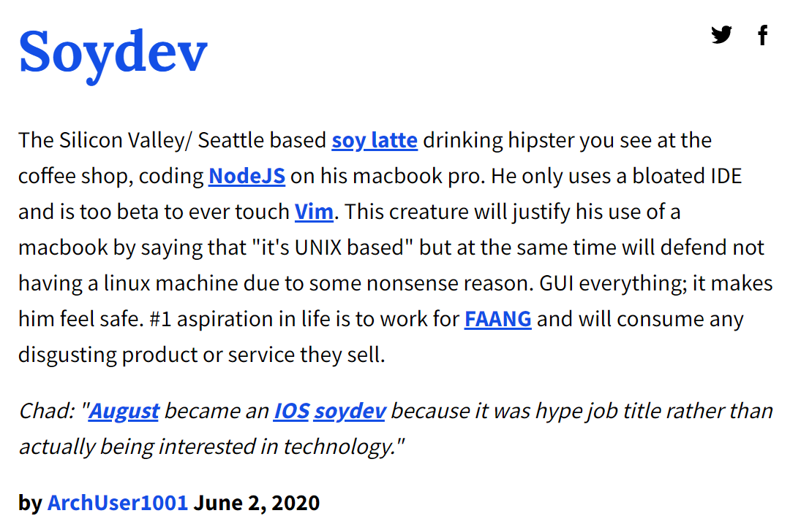
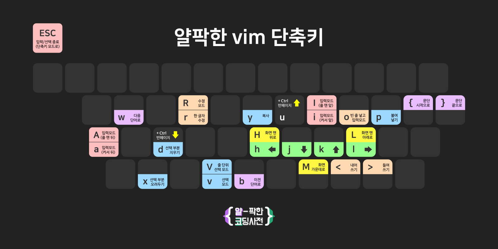

# Vim

오늘은 영상 반, 게임 반으로 이루어진 세션입니다.

30분 정도 vim 관련 유튜브 영상을 본 뒤, vim-adventure 라는 게임을 간단히 소개하고,
nvim을 깔아보는 시간을 갖겠습니다.

[](https://www.youtube.com/watch?v=h_lpTMWrwRc)

앗, 잘못된 유튜브를 가져왔네요...

구독자 166만명 유튜버 fireship의 vim 소개 영상을 봅시다. 딱 2분만 봐도 됩니다.

[](https://www.youtube.com/watch?v=-txKSRn0qeA)

## Soydev란?

https://www.urbandictionary.com/define.php?term=Soydev



Soydev를 벗어나기 위해서는 vim을 배워야 한다!

한국에도 슬슬 많은 vim 관련 영상이 올라오기 시작했습니다.

코딩애플

[](https://www.youtube.com/watch?v=LmGB0uUnkR8)

드림코딩 

[](https://www.youtube.com/watch?v=cY0JxzENBJg)

김왼손

[](https://www.youtube.com/watch?v=Oj0if8rL-wo)

얄팍한 코딩사전

[](https://www.youtube.com/watch?v=qn1soztN7k4)


제가 좋아하는 많은 코딩 관련 유튜버들이 vim에 대해 소개하고 있습니다.

좋아하는 유튜버의 영상을 찾아서 시청해보는 것을 추천합니다~


## Vim Cheatsheet

  

이 정도만 알아도 충분합니다!여기 있는 내용들을 자세히 다음 시간에 배워볼 겁니다.

## nvim 설치 방법

macOS, Linux에는 vim이 이미 깔려있습니다. Windows는

https://www.vim.org/download.php

여기에 들어가서 설치하면 됩니다.
그런데 nvim을 설치하는 것을 권장할게요.

https://neovim.io/

nvim과 vim의 기능은 완전히 동일합니다. 단지 nvim이 조금 더 유저 친화적이라서, 초보에게 더 친절합니다.

### nvim의 장점

1. vim은 1976년에 만들어진 vi를 계승한 에디터 답게 매우 비직관적이고 이상한 초기 설정을 가지고 있는데, nvim은 이를 개선했습니다.
2. nvim의 코드는 vim에 비해 훨씬 더 깔끔하고 직관적이어서 수많은 사람들이 github에 기여하고 있습니다. 반면 vim은 한명의 메인테이너가 주로 모든 개발을 담당합니다.
3. nvim은 기괴하고 불편한 vimscript 대신 lua라는 깔끔한 스크립팅 언어를 사용해서 튜닝할 수도 있습니다. 덕분에 수많은 플러그인들이 만들어지고 있습니다.

nvim과 vim 사이의 갈등은 다음 시간에 언급하고, neovim을 깔아보겠습니다.

### windows
```
choco install neovim
```

### macOS
```
brew install neovim
```

그 이후 윈도우 유저들은 파워쉘 터미널에서, macOS 유저들은 zsh에서
```
nvim main.py
```

라고 입력하시면 파이썬 파일을 생성할 수 있습니다.


## vscodevim 설치

nvim을 설치하긴 했지만, IDE만큼의 기능을 추가하려면 설정을 많이 건드려줘야 합니다.
저희는 그럴 시간이 없으므로, 실생활에서 vim을 사용할 수 있도록 vscode에도 vim keyboard layout extension인 vscodevim을 설치해보겠습니다.

https://marketplace.visualstudio.com/items?itemName=vscodevim.vim

위 링크에 들어가 Install을 눌러 직접 설치하거나,

vscode 플러그인에서 ctrl + shift + p를 눌러 command palette를 소환한 다음, install extensions를 검색하고 엔터를 누릅니다. 그 이후 vscodevim을 검색해 익스텐션을 설치합니다.

이후 새로운 파일을 생성해 커서를 관찰해봅시다. 커서가 직사각형 모양의 네모로 변했다면 vscodevim이 정상적으로 설치된 겁니다.

vscodevim 익스텐션을 disable하면 다시 커서가 정상적인 모양으로 돌아오는 것을 볼 수 있습니다.


## vim adventure

단축키를 익히는 건 사실 쉬실 일이 아닙니다. 다행히, vim 학습을 돕는 다양한 사이트들이 있습니다. 

- https://vim-adventures.com/
- https://openvim.com/
- http://vimgenius.com/

이 중에서, 우리는 오늘 간단히 vim adventures 게임을 3단계까지만 해보면서 손을 풀어 볼 겁니다.


끝으로, fireship의 영상으로 이번 강의를 마치겠습니다.

[](https://youtu.be/h55emgImrLk?t=198)

모두 vim 써서 부모님께 효도합시다!