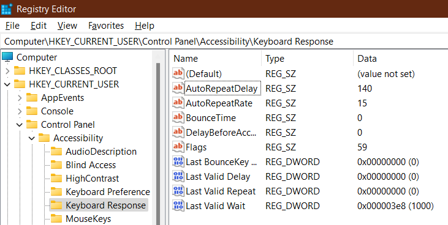
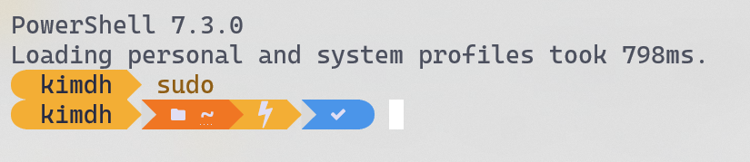
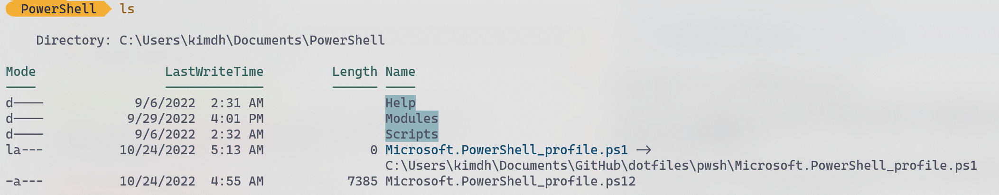
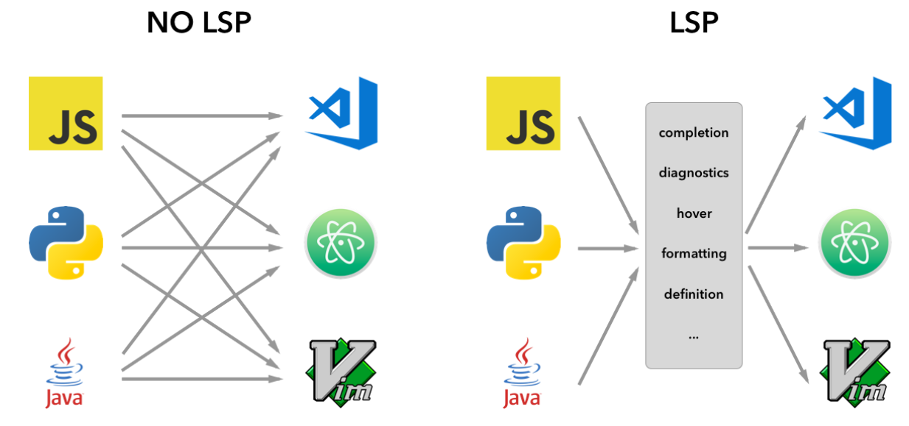

# 이번 학기 마지막 강의

## KUCC에서만 배울 수 있는 꿀팁

### TIP 1: vim이 5배로 빨라지는 방법

#### 참고

키보드 레지스트리 설정으로 반응속도 올리기

<https://homeboy004.tistory.com/61>

Hotkeys, Rapid Fire and Repeat Rate

<https://sc2swarm.com/index.php/2019/10/08/hotkeys-rapid-fire-and-repeat-rate/>

Keyboard repeat rate/delay edits - Best method?

<https://www.reddit.com/r/starcraft/comments/laxds1/keyboard_repeat_ratedelay_edits_best_method/>

  

윈도우 키를 누르고 regedit 혹은 registry editor 혹은 레지스트리 편집기를 연다.

Edit -> Find 를 누른 후 autorepeatdelay를 검색한다.

Computer\HKEY_CURRENT_USER\Control Panel\Accessibility\Keyboard Response

이 위치를 직접 찾아들어가도 된다.

기본값들을 기억한다. 스크린 캡처를 찍어두는 것을 추천합니다.

이후 사진과 같이 값들을 맞춰준다.

- AutoRepeatDelay == 200
- AutoRepeatRate == 15
- BounceTime == 0
- DelayBeforeAcceptance == 0
- Flags == 59

위와 같이 값들을 설정 후 컴퓨터를 껐다가 다시 켭니다.

이제 키보드를 꾸욱 누르고 있을 때, 거의 즉시 repeat 기능이 활성화됩니다. 뿐만 아니라 속도도 매우 빠릅니다.

이로써 vim에서 hjkl키 혹은 wbe키를 누르면 정말 빠른 속도로 화면을 오가는 것을 볼 수 있습니다.

되돌리는 방법: 다시 레지스트리 편집기를 연 뒤, 미리 기록해둔 기본값으로 위 5가지 변수들을 복구한 뒤 컴퓨터를 재부팅합니다.

## TIP 2: windows sudo로 관리자 권한에서 profile.ps1 사용하기

윈도우 콘솔이나 파워쉘에서 관리자 권한이 필요할 때마다 하던 작업을 멈추고 관리자 권한 터미널을 여느라
얼마나 귀찮으셨나요? 리눅스처럼 *sudo*를 사용할 수 있으면 얼마나 좋을까요?
게다가 관리자 권한 파워쉘은 애써 설정한 profile.ps1 을 사용할 수도 없습니다.
손에 익은 다양한 alias들을 사용하지 못해 생산성은 더 줄어듭니다.

다행히, 윈도우에도 sudo가 있습니다. gsudo라고, 원래 있는 건 아니고 누가 비슷한 일을 하도록 third-party로
만들어 둔 건데요. gsudo를 사용하면 관리자 권한 파워쉘을 바로 열 수 있을 뿐만 아니라,
profile.ps1까지 적용시킬 수 있습니다.

관리자 권한 파워쉘에서

``` pwsh
choco install gsudo -y
```

를 사용해 choco설치 후 창을 닫고,

유저 파워쉘에서

``` pwsh
gsudo
```

혹은

``` pwsh
sudo
```

를 사용하면 자동으로 파워쉘이 관리자 권한으로 바뀝니다.

  

위 사진처럼 oh-my-posh 테마에 번개 표시가 생긴 것을 볼 수 있습니다. 관리자 권한으로 승격된 것입니다.

## Symbolic Link 사용법

> Symbolic link란? 개발자를 위한 바로가기

이제 이번 강의에서 가장 중요한 Symbolic link에 대해 배워보겠습니다. 저희는 지금까지
profile.ps1, .vimrc, .zshrc 등 수많은 설정 파일들을 작성해왔고, 앞으로도 개발자로 살아가면서 그럴 겁니다.

이들을 간편하게 dotfiles라고 부르겠습니다. 설정 파일들은 주로 이름 맨 앞에 .이 붙은 경우가 많아 이들을 부르는 총칭입니다.

이 dotfile들을 계속 백업하고 싶다면 어떻게 해야 할까요?

1. 구글드라이브와 같은 클라우드에 백업하기

    많은 사람들이 애용하는 방법입니다. 단 이 경우, 일일이 모든 파일들을 손으로 복사해줘야 하는 단점이 있습니다.

2. git과 github을 사용하기

개발자들에게 가장 친숙한 VCS를 사용하는 방법도 있습니다.
그런데 문제가 있습니다. profile 파일들을 매번 복사해줘야 할까요?

예를 들어, 깃헙에 dotfiles라는 레포를 만들고
~/documents/github 이라는 위치에 dotfiles 레포지토리를 clone했다고 합시다.
우리는 매번 일일이 손으로 .vimrc, init.vim, profile.ps1, .zshrc, .bashrc 파일들을 복사해줘야 할까요?

아니면

``` bash
cp ~/.vimrc ~/documents/github/dotfiles/
cp ~/.zshrc ~/documents/github/dotfiles/
cp ~/.bashrc ~/documents/github/dotfiles/
cp ~/documents/powershell/Microsoft.PowerShell_profile.ps1 ~/documents/github/dotfiles/
cp ~/.config/nvim/init.vim ~/documents/github/dotfiles/
```

위와 같은 스크립트를 만들어서 매일 매일 자동으로 돌려줘야 하는 걸까요?

물론 위 방법도 해결책이 될 수 있겠지만, 더 간편한 방법은 symbolic link를 사용하는 것입니다.

심볼릭 링크(혹은 소프트 링크)는 프로그래머를 위한 바로가기라고 생각하시면 됩니다.

### 사용 방법

#### powershell 유저

본인의 profile에

``` powershell
function ln ($target, $link) {
    new-item -path $link -itemtype SymbolicLink -value $target
}
```

를 추가합니다. 그리고 gsudo를 통해 관리자 권한 모드에 진입합니다.

``` text
ln <원본 위치> <바로가기를 만들고 싶은 위치>
```

위 문법을 통해 만들 수 있습니다.

#### macOS, linux 유저

``` text
ln -s <원본 위치> <바로가기를 만들고 싶은 위치>
```

위 문법을 통해 만들 수 있습니다. -s 를 주의하세요.

#### 사용 예시

모든 dot 파일들을 dotfiles라는 깃헙 레포에 집어넣습니다. 예를 들어

``` text
~/documents/github/dotfiles/
```

에 몰아넣었다고 합시다.

각각의 dotfiles들에 대해 심볼릭 링크를 생성합니다.

윈도우 유저가 profile.ps1에 대한 바로가기를 생성하는 법:

``` pwsh
# 관리자 권한을 잊지 마세요!
ln ~/documents/github/dotfiles/Microsoft.Powershell_profile.ps1 ~/documents/WindowsPowerShell/Microsoft.PowerShell_profile.ps1
```

맥, 리눅스 유저가 .zshrc의 바로가기를 생성하는 법:

``` sh
# 리눅스는 sudo 없어도 됩니다!
ln -s ~/documents/github/dotfiles/.zshrc ~/.zshrc
```

이후, 바로가기가 위치하는 폴더로 가서 ls (zsh 유저는 ls -l)를 찍어보면

  

이런 식으로 심볼릭 링크 이름과 화살표, 그리고 원본 파일이 존재하는 위치가 표시되면 성공입니다.
이미지에서 Mode를 주목하시면, 심볼릭 링크 파일은 la---라고 적혀있는 걸 볼 수 있는데, 해당 파일이 심볼릭 링크라는 것을 뜻합니다.

#### 윈도우 바로가기 안 쓰고 심볼릭 링크 쓰는 이유?

윈도우 바로가기는 특정 application을 위한 특정 파일 포맷이라 대부분의 프로그램에서 오작동합니다.
반면 symbolic link는 **OS file system level**에서 자체적으로 지원... 하기 때문에
99%의 프로그램들이 symbolic link를 똑같은 파일로 취급합니다.

그냥 프로그래머는 바로가기를 만들때
**99%의 경우에 symbolic link를 자주 쓴다**고 생각하시면 편합니다.

참고: 하드링크라는 것도 있는데 모르셔도 됩니다.

## LSP

- formatting
- linting
- syntax / semantic highlighter
- autocompletion
- hover
- debug

<https://code.visualstudio.com/api/language-extensions/language-server-extension-guide>

  

LSP 덕분에, 에디터(그리고 IDE)간의 경계가 거의 사라졌습니다. vim에서도 vscode의 대부분의 기능들을 누릴 수 있습니다!

## Finally

  

> 여러분은 2022학년도 2학기 가을 KUCC Choco 세션을 모두 수강하셨습니다.
> 축하합니다!!
